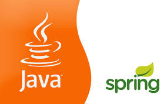

### Hi there.... 👋

My name is **Andi**.

I am currently working on [PT. International Chemical Industry](https://www.abc-battery.com/) as **IT Developer**.

Besides that, I'm a master's degree student at Bina Nusantara University.

**Technical Skills:**

<code></code>
<code></code>
<code></code>

More about me, please visit [Linkedin](https://www.linkedin.com/in/andititony/). 

<!--
**godinandi/godinandi** is a ✨ _special_ ✨ repository because its `README.md` (this file) appears on your GitHub profile.

Here are some ideas to get you started:

- 🔭 I’m currently working on ...
- 🌱 I’m currently learning ...
- 👯 I’m looking to collaborate on ...
- 🤔 I’m looking for help with ...
- 💬 Ask me about ...

- 😄 Pronouns: ...
- ⚡ Fun fact: ...
-->
